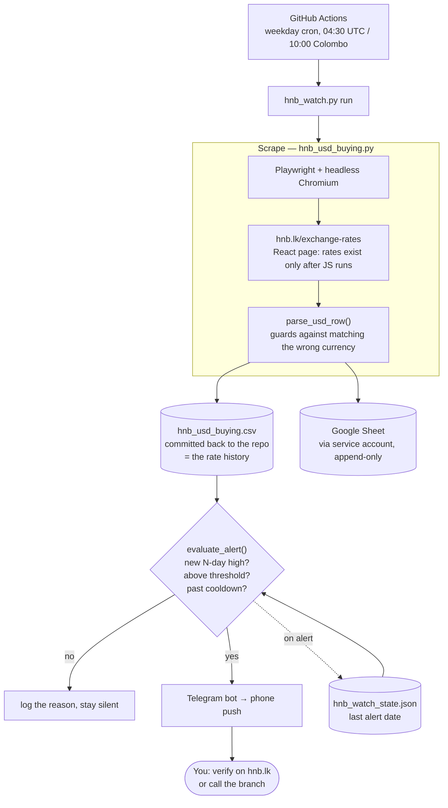

# HNB USD Rate Watcher

Tracks Hatton National Bank's published USD/LKR **telegraphic transfer buying rate**, records
each reading, and sends a Telegram alert when the rate reaches a high worth acting on.

The goal is practical: if you hold USD and intend to convert to LKR, you want the bank's
**buying** rate to be **high**. This watches for that and tells you, so you are not converting
on an ordinary day without knowing what recent days looked like.

Runs unattended on GitHub Actions every weekday. Nothing needs to be running on your machine.

---

## Architecture



### Why a headless browser

`hnb.lk/exchange-rates` is a client-rendered React app. A plain HTTP fetch returns only a
"you need to enable JavaScript" stub — no rates at all. So the page must actually be rendered.
Playwright downloads its own Chromium, isolated from any browser you use day to day.

If HNB ever exposes a JSON endpoint, this whole component could be replaced by a few lines of
Google Apps Script and the browser dependency dropped entirely. Worth checking the Network tab
occasionally.

---

## Files

| File | Role |
| --- | --- |
| `hnb_usd_buying.py` | Scraper and parser. Also `fetch` / `plot` / `show` commands for local use. |
| `hnb_watch.py` | Daily entrypoint: scrape → CSV → sheet → alert. Owns the alert rule. |
| `verify_setup.py` | Offline self-check: parser regression tests, dependencies, config sanity. Never prints secret values. |
| `hnb_usd_buying.csv` | The rate history. Committed by CI on each run. |
| `.github/workflows/hnb-watch.yaml` | The schedule and the cloud run. |

---

## Local use

```bash
python3.12 -m venv .venv
source .venv/bin/activate
pip install playwright pandas gspread google-auth requests matplotlib
python -m playwright install chromium

python verify_setup.py          # confirm everything is wired correctly
python hnb_watch.py run         # scrape, record, alert if warranted
python hnb_watch.py backtest    # replay the alert rule over existing history
python hnb_usd_buying.py plot   # chart the trend to a PNG
```

Configuration goes in a `.env` file beside the scripts — never in shell `export` commands,
which would leave tokens in `~/.zsh_history`:

```
TELEGRAM_BOT_TOKEN=...
TELEGRAM_CHAT_ID=...
SHEET_ID=...
GOOGLE_SA_JSON=/absolute/path/to/sa.json
```

```bash
chmod 600 .env
```

Real environment variables always override `.env`, so CI is unaffected.

---

## Alert rule

| Setting | Meaning |
| --- | --- |
| `ALERT_MODE=n_day_high` | Fire when today beats every reading in the window. |
| `ALERT_MODE=threshold` | Fire at or above `ALERT_THRESHOLD`. |
| `ALERT_MODE=both` | Either condition fires; both are reported. |
| `ALERT_WINDOW=30` | Days considered for `n_day_high`. |
| `ALERT_COOLDOWN_DAYS=3` | Stay quiet this long after an alert. |

**During the first month, `n_day_high` will rarely fire** — it has almost nothing to compare
against. Set `ALERT_THRESHOLD` to a rate you would genuinely act on and use `ALERT_MODE=both`
until the history fills out.

---

## CI configuration

Repository → Settings → Secrets and variables → Actions.

**Secrets:** `GOOGLE_SA_JSON` (entire key file contents), `SHEET_ID`,
`TELEGRAM_BOT_TOKEN`, `TELEGRAM_CHAT_ID`

**Variables** (optional, no secrets): `ALERT_MODE`, `ALERT_WINDOW`, `ALERT_THRESHOLD`,
`ALERT_COOLDOWN_DAYS` — kept as variables so the rule can be retuned without editing code.

Also required: Settings → Actions → General → Workflow permissions → **Read and write**, so the
job can commit the updated CSV.

Email delivery is deliberately **not** used. A Gmail App Password grants permanent send-as-you
access to an entire mailbox; a Telegram bot token can only message you. Same notification,
far less authority.

---

## Security notes

- No secret is ever committed. `.gitignore` blocks `.env`, all `*.json`, and key material.
  The service account key lives outside the repository.
- The service account is scoped to `spreadsheets` only and can reach a sheet solely because that
  sheet was explicitly shared with its address. Its key can be revoked in the Google Cloud
  console without touching your Google account.
- `verify_setup.py` reports whether credentials are *present* and warns on loose file
  permissions, but never prints their values.

---

## Limitations worth knowing

**The published rate is probably not your rate.** HNB states these figures are indicative, for
amounts up to roughly USD 1,000. For a larger conversion, the branch or treasury desk will often
quote better. Treat an alert as *go and ask*, not as the rate you will receive.

**An N-day high is not a forecast.** The rule reports that today beats recent days. It says
nothing about tomorrow. This is not financial advice, and FX direction is not predictable from a
month of published rates. What it does reliably is stop you converting on a poor day unaware.

**Scheduled runs are not punctual.** GitHub delays cron under load — sometimes by 10–30 minutes,
occasionally skipping a run. Fine for daily rates; trigger manually if a day is missed.

**The alert cooldown resets in CI.** `hnb_watch_state.json` is gitignored, so a rate parked above
your threshold may alert daily rather than every `ALERT_COOLDOWN_DAYS`. Fix by committing the
state file or moving the cooldown into the sheet.

**Scraping is inherently brittle.** The parser reads a rendered page, so a layout change can
break it. It is written to fail loudly rather than guess: it rejects any line naming another
currency, refuses prose lines, and raises with a list of what it considered and why.

> This last point is not hypothetical. An early version matched the page's disclaimer
> ("…up to **USD** 1000…"), then read the *next* table row and silently reported **AUD's** rate
> as USD — a plausible-looking number, no error, no warning. The guards and the regression tests
> in `verify_setup.py` exist because of that bug. Spot-check new readings against hnb.lk before
> trusting an alert with real money.
